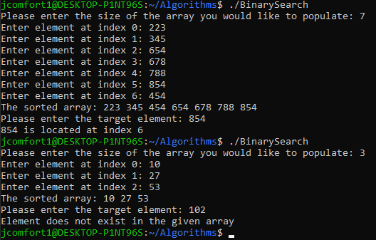
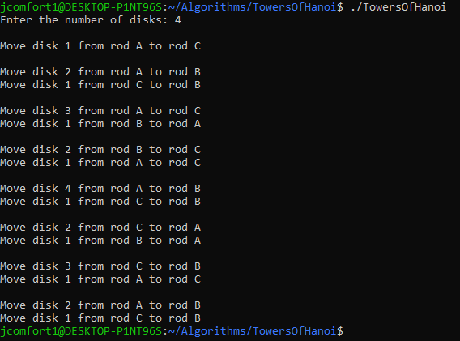
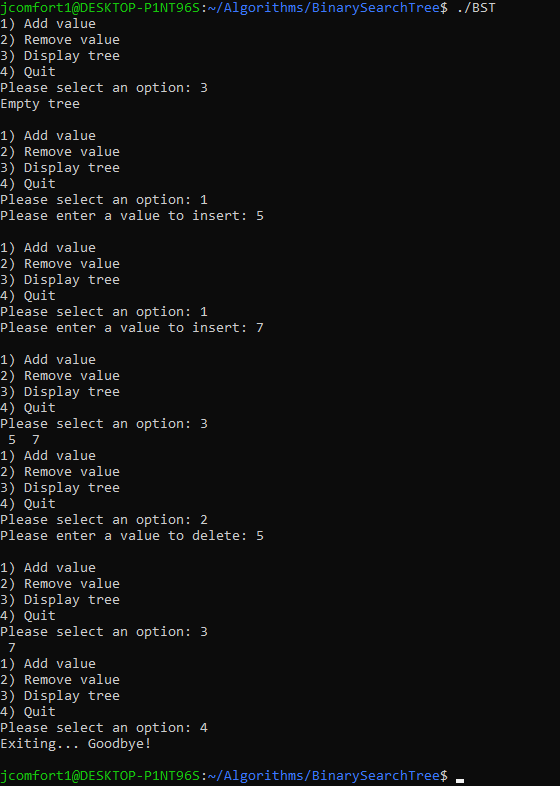

# Algorithms & Data Structures
A collection of classic computer science algorithms implemented in C.

## Executing the Code

- gcc -o prog_name prog_file.c
- ./prog_name

## Implemented Algorithms

- Binary Search

  Allows users to input the size of an array and fill it with integer elements. The user is then prompted for the value they want to find the index of. Binary search is then used to find the index of the target element. If the element exists, the index is printed on the screen. Otherwise, an error message reports that the value does not exist in the given array.

  ### Sample Output:
  

- Towers of Hanoi

  Allow users to input the number of disks they want to play the Towers of Hanoi game with. Implementation is recursive, the output of each move is printed to the console.

  ### Sample Output:
  

- Binary Search Tree
 
  A simple binary search tree implementation that allows users to add and remove nodes from the tree as they wish. Additionally, the current status of the tree can be displayed via an in-order traversal of the BST. 

  

- Graph (Adjacency Matrix)

  A simple graph representation that was implemented using an adjacency matrix. A list of edges is defined and a graph is created using the list. The graph is stored in an array, that keeps track of the nodes, each holding a source and destination.

  

